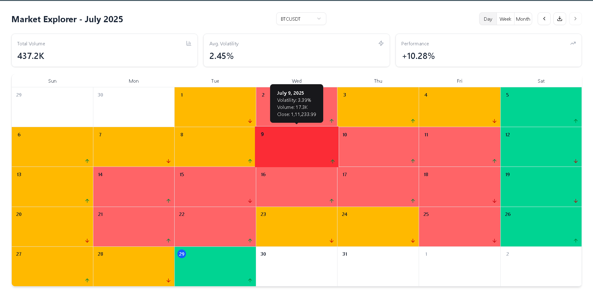

Market Seasonality Explorer

An interactive web application for visualizing historical volatility, liquidity, and performance data for financial instruments on a dynamic calendar heatmap.

📚 Documentation

Detailed documentation (API reference, usage guides, etc.) is available at:

https://market-seasonality-explorer.pages.dev/

Feel free to explore and refer to it for setup steps, examples, and configuration info.

✨ Features

  1) Interactive Calendar Heatmap: Visualize daily market performance with a color-coded system (blue for low volatility, indigo for high).

  2) Multi-Timeframe Analysis: Seamlessly switch between Daily, Weekly, and Monthly aggregated data views.

  3) Live API Integration: Fetches real-time historical data from the public Binance API.

  4) Instrument Filtering: Easily switch between different cryptocurrency pairs (e.g., BTCUSDT, ETHUSDT).

  5) Slide-Out Details Panel: Click on any day to view detailed OHLC data, volume, and an intraday price chart.

  

  6) Design: A clean and modern UI that works flawlessly on desktop, tablet, and mobile devices.

  7) Keyboard Navigation: Fully accessible calendar navigation using arrow keys.

  8) CSV Export: Download the raw daily data for the currently viewed month as a CSV file.

  9) Animated UI: Smooth, fluid animations for all interactions, powered by Framer Motion.

🛠️ Tech Stack & Libraries

This project was built with a modern, performance-oriented tech stack.

    Framework: React with Vite

    Language: TypeScript

    State Management: TanStack Query (React Query) for server state management.

    Styling: Tailwind CSS for utility-first styling.

    UI Components: shadcn/ui for accessible and composable base components.

    Charting: Recharts for the intraday price chart.

    Animation: Framer Motion for all UI animations.

    Date Management: date-fns for all date-related logic.

    CSV Parsing: Papaparse for CSV export functionality.

    Icons: Lucide React

Design and Architecture
  Server State Management: All API interactions are handled by TanStack Query. This separates the concern of managing asynchronous server data from our client-side UI state, resulting in less code and more robust features like caching and background updates.

  File Structure: The src directory is organized by feature/responsibility (api, components, features, utils, types) to make the codebase easy to navigate and maintain.

  Public API: The application uses the Binance Klines API. To maintain clean separation of concerns, the API fetching logic is organized within a dedicated api/ directory.

